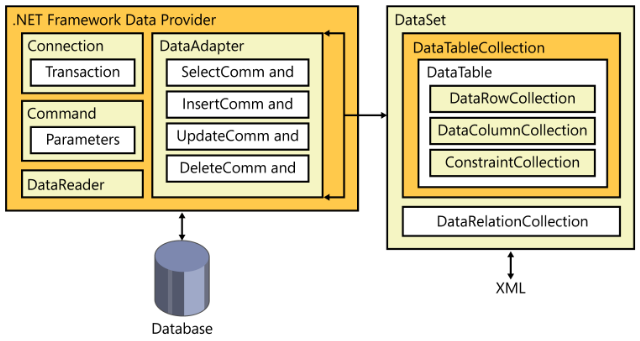

# .Net Starter Template (to whom it may concern)
SOLID, DI, N-Tier, Logs, etc.

# C Sharp - C# language

* **Modifiers:**
  - **virtual**: A method, property, indexer or event declaration can be overridden by any derived class. (Useful to support lazy loading with **Entity Framework**).  

# Tools
* **[ASP.NET Dynamic Data](https://msdn.microsoft.com/en-us/library/ee845452.aspx)**: Dynamic Data enables you to create a data-driven Web site with little or no coding (Only a simple CRUD).
* **NuGet**: is a free and open-source package manager designed for the Microsoft development platform.
  * Commands:
    - Install-Package EntityFramework -Latest non-beta
    - Uninstall-Package EntityFramework
    - Update-Package Entity Framework -reinstall (all projects)
    - Update-Package EntityFramework -ProjectName MyProject
* **LocalDb**: a lightweight version of the SQL Server Express Database Engine.
  * Data source=(localdb)\mssqllocaldb;
  * Get versions / instances via:
    - sqllocaldb i
    - sqllocaldb v

# Accessing data

## - ADO.NET
Support large loads and to excel at security, scalability, flexibility, and dependability. It has a bias toward a ***disconnected model*** (open a connection to the database, execute the command, and then close the connection as quickly as possible). It have the concept of **connection pooling** (manage the number of active connections for you). ADO.NET is its cross-platform compatibility:
  * **System.Data.SqlClient**
  * **System.Data.OracleClient**
  * **System.Data.OleDb**
  * **System.Data.Odbc**

### .NET Framework data providers
 
 
Components designed for fast data manipulation, for example:
  * **DbConnection**: Any database interaction. Take care, you need to close the connection...
  * **DbCommand**: Parameterization.
  * **DbDataReader**: Provides read-only access to the data. It provide multiple asynchronous methods **(BeginEx-
ecuteNonQuery, BeginExecuteReader, BeginExecuteXmlReader)** that can greatly enhance the user experience.
  * **DbDataAdapter**: Populate only **DataSets** or **DataTables** using the Connection and the Command object.
  * **DataSet**: A portion of **RDBMS** relevant to the application (a collection of DataTable objects). It can be loaded directly from **XML** documents and can be persisted to **XML** natively (take care with the memory because it's an expensive object, so don't store it in **Session** or **Viewstate** variables).
  * **DataTable**: A specific view of data (a table in the RDBMS, although only par-tially populated).

## - Entity Framework
An ORM created by Microsoft. It enables developers to manipulate data as domain-specific objects without regard to the underlying structure of the data store. You can find:
  * Approaches:
    - **Database First:** build a database and then create the conceptual model from it.
    - **Model First:** building your conceptual model first and then letting the tools build out a database for you.
    - **Code First:** create simple classes that represent entities.
  * Toolset:
    - Entity Model Designer: Manipulate every aspect of the model using a **.edmx** file (Create, Delete or Update entities, associations, mappings and inheritance relationships).
    - Entity Data Model Wizard: Build a conceptual model with an existing data store instance.
    - Create Database Wizard: Build the database based on your conceptual model.
    - Update Model Wizard: Update the mappings defined between the storage and the conceptual model
  * Database Control:
    - **Data annotations**:
      - Integrates with MVC validation.
    - **Fluent API**:
      - Keeps domain classes clean.
      - More supported operations (advanced mappings, datetime precision, fixed length and non-Unicode strings, etc).
      - Easily remapping legacy names  to code names.
      - Single type to multiple tables, vice versa.
      - Schema mapping.
      - Mapping table per type, table per class, entity & table splitting.
  * Commands:
    - Enable-Migrations -ContextTypeName NameSpace.MyClassDataContext -EnableAutomaticMigrations //Update the database with the code
    - Update-Database -Script
  * Database Initializers:
    - CreateDatabaseIfNotExists
    - DropCreateDatabaseWhenModelChanges
    - DropCreateDatabaseAlways
  * Viewing queries:
    - context.Database.Log = s => Console.WriteLine(s); //Using System.Diagnostics.Debug
    - Glimpse packgage
    - Interceptors in **.config** file //Using System.Data.Entity.Infrastructure.Interception.DatabaseLogger

# Layered Architectural Pattern (separation of concerns)
* Layered Architectures keep the Software flexible, more resilient to change.
* Allows you to change underlying technologies and implementations.
* Allow you to change how you package and deploy your application.

# Domain Layer
The logic of the business, is a model of business. The rules and needs of the business with the workflow.
Domain Layer is all about the business problem - so keep ti "pure" (Only C# classes, methods, properties, interfaces, enums), free of specific technologies, API's, libraries, frameworks, etc.
The Domain Layer is the main unifying concept of the application... bridging  technical concepts and business concepts. Starting with the Domain Layer help us utilize Test Driven Development. Not every application needs the complexity introduced by a domain layer.

# Presentation Layer
UI Components and Process Components. It should do basic/simple formatting and validation. Also responsible for displaying exceptions, asking for user input on what to do next

# Persistence Layer
The communication with Domain Layer is through C# interfaces/Contracts using Inversion of Control and Dependency Inversion.
The Domain Layer only cares that the Persistence Layer abides by the terms of the contract. Besides CRUD operations, the Persistence Layer should also enforce data integrity constraints, validations, transactions, connection pooling, security, etc.
Object Relation Mappers are used to mapping relational data to object instances. The Persistence Layer is merely an implementation detail (The security is in the Domain).

  To transfer data the following types are used:
  * Simple Types
  * Plain Old CLR Objects (POCOs)
  * Generic Collections of Objects
  * Object Graphs (Relationships of Objects)

# Application Services Layer
Application Services layer orchestrates lower-level, chattier methods to solve higher-level domain-specific problems. Focus on have Cohesive methods and classes adhere to SRP and DRY.
The Application Services Layer has methods that serve the Presentation Layer by rolling-up many lower-level methods into fewer higher-level methods, orchestrating those lower-lever methods to coordinate/collaborate a solution.

# Web Services Layer (WCF or ASP.NET Web API)
Serialize types for transmit over the network. The role of a Web Services layer is to expose web-callable methods to a client application. Web Service methods expose functionality of the Domain Layer of Application Services Layer.

# Data Transfer Objects
Consider consolidating data structures that are passed between layers and tiers. Reduce round-trips between layers and tiers.
The Persistence Layer use DBSet entities, The Domain Layer use Domain Classes and the Presentation Layer use View Model.
With AutoMapper we mapping object instances in a layer to Data Transfer Objects, it assumes convention of property names being called the same, but there´s a way to "hand-roll the mapping", too.
  
  Using DTOs we can:
  * Reduce chatter between tiers.
  * Avoid leaky abstractions.

# Dependency Injection Pattern (Unity, Castle Windsor, Ninject, Autofac, StructureMap, etc)
We can identify 3 rules: 
- A consumer that depends on other classes for some service.
- A declaration of that consumer's need (in the form of a contract/interface).
- Third-party injector that supplies instances of classes that adhere to the contract to the dependent consumer.

Exist the following principles:
 * Dependency Inversion Principle:
   - High-level modules should not depend on low-level modules. Both should depend on abstractions.
   - Abstractions should not depend on details. Details should depend on abstractions.
 * Inversion of Control Principle (Controls the flow of the program)
 
We need to configure the **DI Container** in the "Application Root"... simply, an area of the application that executes very early on.

# SOLID
The **SOLID** Principles are a set of guidelines to help Agile developers build more maintainable and extensible object-oriented applications.

# Design Patterns with GoF (Gang of Four - Erich Gamma, Richard Helm, Ralph Johnson and John Vlissides)
Describe the common patterns to solve common problems. A pattern is a general reusable solution to a commonly occurring problem within a given context in software design.

They are categorized in three groups: 

* **Creational patterns:**
  Define the best way in which an object is instantiated. The aim of these patterns is to abstract the instantiation process and hide the details of how objects are created and initialized. For example:
  - **Factory method:** Centralize creation of an object of a specific type choosing one of several implementations.
  - **Lazy initialization:** Tactic of delaying the creation of an object, the calculation of a value, or some other expensive process until the first time it is needed.
  - **Prototype:** Used when the type of objects to create is determined by a prototypical instance, which is cloned to produce new objects.
  - **Singleton:** Restrict instantiation of a class to one object.
  
* **Structural patterns:**
  Create groups of objects to help us perform complex tasks. For example:
  - **Adapter:** Convert the interface of a class into another interface clients expect. An adapter lets classes work together that could not otherwise because of incompatible interfaces.
  - **Decorator:** Attach additional responsibilities to an object dynamically keeping the same interface. Decorators provide a flexible alternative to subclassing for extending functionality.
  - **Facade:** Create a simplified interface of an existing interface to ease usage for common tasks.

* **Behavioral patterns:**
  Define communication between system objects and the flow of information between them. For example:
  - **Observer:** Define a one-to-many dependency between objects where a state change in one object results in all its dependents being notified and updated automatically.
  - **Strategy:** Define a family of algorithms, encapsulate each one, and make them interchangeable. Strategy lets the algorithm vary independently from clients that use it.
  - **Iterator:** Provide a way to access the elements of an aggregate object sequentially without exposing its underlying representation.

# Concepts
* **Layers:** are about logical organization of code.
* **Tiers:** are the physical deployment of layers (only about where the code runs).
* **Cross-cutting concerns:** are aspects of a program that affect other concerns (Security, Communication, Operational Management, Handling, Logging, Validation, Instrumentation, etc).
* **DRY:** Don't repeat yourself. "Every piece of knowledge must have a single, unambiguous, authoritative representation within a system".
* **SRP:** Single responsibility principle. Every module or class should have responsibility over a single part of the functionality provided by the software, and that responsibility should be entirely encapsulated by the class. "A class should have only one reason to change".
* **YAGNI:** You aren't gonna need it. "Always implement things when you actually need them, never when you just foresee that you need them".
* **TDD:** Test Driven Design.
* **DDD:** Domain Driven Design.
* **Architecture:** Application architecture seeks to build a bridge between business requirements and technical requirements by understanding use cases, and then finding ways to implement those use cases in the software.
* **Facade:** Common pattern name used to identify a thin layer of code that wraps around other code to present a "friendly" interface/interaction.
* **SOLID:** single responsibility, open-closed, Liskov substitution, interface segregation and dependency inversion. The intention is that these principles, when applied together, will make it more likely that a programmer will create a system that is easy to maintain and extend over time.
* **POCO:** Plain Old CLR Object. Identify an object as a simple object, as opposed to the complicated. Some benefits of POCO objects are:
  - Allows a simple storage mechanism for data, and simplifies serialization/passing data through layers.
  - Goes hand-in-hand with dependency injection, and the repository pattern.
  - Minimized complexity and dependencies on other layers (higher layers only care about the POCOs, POCOs don't care about anything) which facilitates loose coupling.
  - Increases testability through simplification.
* **LINQ:** Language Integrated Query.
* **ORM:** Object-Relational Mapping.
* **CSDL:** Conceptual Schema Definition Language.
* **SSDL:** Store Schema Definition Language.
* **MSL:** Mapping Specification Language (Handle the mapping between the CSDL and SSDL). It was used in older versions of **EF**.
* **T4:**  is the templating and code generation engine that **EF** uses to generate code. T4 text template files can often be identified by the **.tt** extension.
